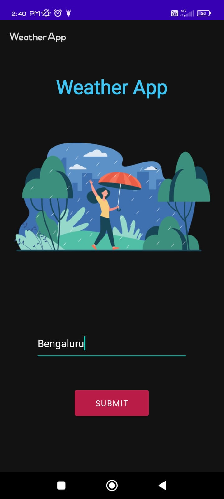
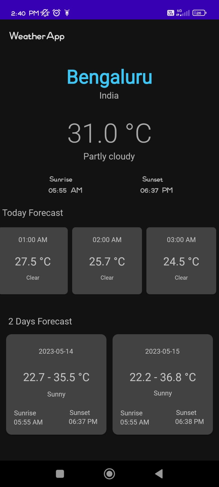

# Weather Forecast App

This is a simple Weather Forecast Android App that can be used to check the daily weather conditions and two days forecast. It is developed using Java and Android Studio. The data were fetched using the <a href="https://weatherapi.com">WeatherAPI</a> using the volley library.

### Features:
- Show the current weather for any city.
- Show the daily forecast for that day in one hour gap.
- Show two days forecast including Min Temperature, Max Temparature.

### Screenshots

   
